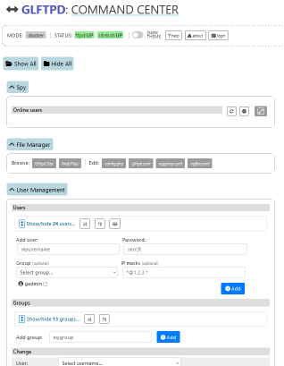

# docker-glftpd (v3)

[](https://github.com/silv3rr/docker-glftpd/actions/workflows/docker.yml)

Dockerized [glftpd](https://glftpd.io) for all 😎

Optionally adds [pzs-ng](https://pzs-ng.eu) and [Web UI](#WebUI)

GitHub container registry: [docker-glftpd](https://github.com/users/silv3rr/packages/container/package/docker-glftpd)

## Quick Start

Usage: `./docker-run.sh` or `docker run ghcr.io/silv3rr/docker-glftpd`

This gets a non-persistent ftp up and running. Good for trying things out.

It uses these default settings:

- listen port is 1337
- ftp login: glftpd/glftpd, internal ip ranges allowed
- no permanent config, udb or storage
- does not include zs, bot or webui components

Change password for 'glftpd' user: `GLFTPD_PASSWD="MyPassw0rd" ./docker-run.sh`

## Customizing

To use permanent configuration, add zipscript, bot and webui components you can set environment variables before starting docker build/run scripts.

**Example**:

```
# copy/paste to run a 'full' permanent glftpd setup, with bot and webui:

GLFTPD_PERM_UDB=1 \
GLFTPD_CONF=1 \
GLFTPD_SITE=1 \
IRC_SERVERS="irc.efnet.org:6667 irc2.example.org:6697" \
IRC_CHANNELS="#pzs #pzs-staff" \
USE_FULL=1 \
WEBUI=1 \
./docker-run.sh
```

For details about an even more tailored setup (diferrent ip/port, gl ver etc), or changing the images, see [docs/Customization.md](docs/Customization.md). Also check this page for using sitebot and info about adding 3rd party scripts.

### Images

To use prebuild images from github, just run: `./docker-run.sh`.

Or, for the 'full' glftpd image: `USE_FULL=1 ./docker-run.sh`

## Scripts

### docker-run.sh

Main script that takes care of creating/changing config files and docker runtime args for you. Then it starts glftpd and web-gui container.

Uses env vars to change settings. Put them in front of script, e.g.
`FORCE=1 GLFTPD_PASV_ADDR="1.2.3.4" ./docker-run.sh`.

**Example**:

```
# change gl ports:
GLFTPD_CONF=1 GLFTPD_PORT="7113" GLFTPD_PASV_PORTS="8888-9999" ./docker-run.sh

# permanent glftpd.conf, udb and storage:
GLFTPD_CONF=1 GLFTPD_PERM_UDB=1 GLFTPD_SITE=1 ./docker-run.sh
```

### docker-build.sh

Wrapper script to (re)build images that can be used for local images besides the prebuild images from github registry.

See [docs/Build.md](docs/Build.md)

### docker-build-zs.sh

Recompiles pzs-ng inside temporary container.

Run this script with a modified zsconfig.h in same dir, and it will put the updated bins in custom/pzs-ng/bin. Also see [docs/Customization.md](docs/Customization.md).

## Compose

What about docker compose you ask? Sure, just run `docker compose up --detach`. Details: [docs/Compose.md](docs/Compose.md).

## Variables

See [docs/Variables.md](docs/Variables.md) for all available options.

## WebUI

[](docs/webui.png)

A web interface can optionally be installed as a bonus. This separate container can be used to manage glftpd and bot etc from the comfort of your browser.. it's quite the prize.

Start: `WEBUI=1 ./docker-run.sh` or `docker run ghcr.io/silv3rr/docker-glftpd-web`

Open url: https://your.ip:4444 and login: `shit/EatSh1t`  (basic web auth).

For more screenshots and information see [github.com/silv3rr/glftpd-webui](https://github.com/silv3rr/glftpd-webui)

## Files

See [docs/Files.md](docs/Files.md) for directory structure.

## Issues

- why would you use this? uhh i dunno, cuz ur too stupid to setup gl urself?! :P
- why does the web interface suck? .. it was originally named SHIT...
- will it run on windows, macos or k8s? no idea, probably.. try it. podman? probably not
- hashgen doesnt work? try recompiling: `gcc -o hashgen hashgen.c -lcrypto -lcrypt`
- the bot doesnt start? check owner/perms of sitebot files
- why bind mounts? if you want volumes instead .. change `type` in docker-run.sh / docker-compose.yml
- other than that, just `rm -rf ./glftpd; docker rm -f glftpd` to start over

## Contents

so, i heard you like reading..

check these pages for more details about how the docker image and scripts work

- [docs/Build.md](docs/Build.md)
- [docs/Compose.md](docs/Compose.md)
- [docs/Customization.md](docs/Customization.md)
- [docs/Files.md](docs/Files.md)
- [docs/Run.md](docs/Run.md)
- [docs/Variables.md](docs/Variables.md)

## Changes

See [docs/Changelog.md](docs/Changelog.md)
