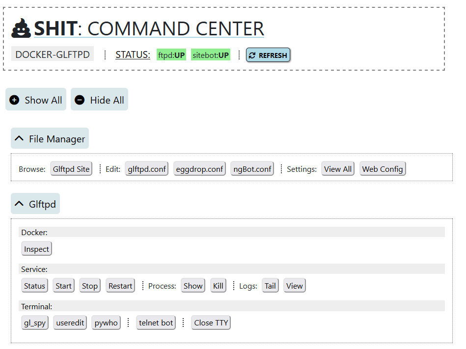
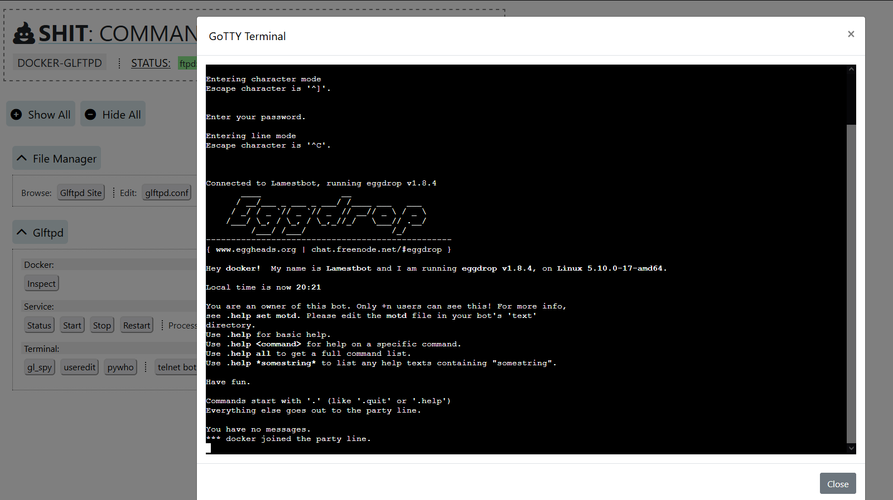

# docker-glftpd

[](https://github.com/silv3rr/docker-glftpd/actions/workflows/docker.yml)

Dockerized [glftpd](https://glftpd.io) (and optionally [pzs-ng](https://pzs-ng.eu))

View github container registry: <https://github.com/users/silv3rr/packages/container/package/docker-glftpd>

## Quick Start

`docker run ghcr.io/silv3rr/docker-glftpd`

Without changing anything, this gets a temp ftp up and running. Good for testing.

It uses these default settings:

- listen port is 1337
- ftp login: glftpd/glftpd, internal ip ranges allowed
- no permanent config, udb or storage
- does not include zs and bot component

Test connection: `./test/login.sh` (also shows bind ip ;p)

To change password for 'glftpd' user: `GLFTPD_PASSWD="<Passw0rd>" ./docker-run.sh`

## Customizing

There is also an image tagged 'full' available which includes zs and bot components, as it's build with `INSTALL_ZS=1` `INSTALL_BOT=1`.

Usage: `USE_FULL=1 ./docker-run.sh` or: `docker run ghcr.io/silv3rr/docker-glftpd:full`

By using runtime environment variables glftpd can be configured, use a permanent userdb, change site storage and add components. It's also possible to edit gl and pzs-ng config files.

Some changes require either the 'full' image or a local image build (and/or restarting container).

You don't have to use any of the included scripts and stuff, the images work fine on their own. Also, see below if you prefer using [docker-compose](#docker-compose).

### Paths

All paths are relative to where ever you git cloned this repo and run docker from, e.g.

- local ./glftpd/glftpd.conf on host gets mounted as /glftpd/glftpd.conf in container
- local ./glftpd/sitebot/eggdrop.conf on host gets mounted as /glftpd/sitebot/eggdrop.conf in container
- local ./glftpd/site on host gets mounted as /glftpd/site in container

### Components

**ZS**: adds pzs-ng. Configured by editing pzs-ng/zipscript/conf/zsconfig.h as usual. Needs  rebuild after changing zsconfig.h. Requires image build with `INSTALL_ZS=1`.

**BOT**: adds optional sitebot which will listen on port 3333. Login using telnet and default user/pass `docker/EatSh1t`. Needs irc server set in glftpd/sitebot/eggdrop.conf. ngBot can be configured in pzs-ng/sitebot/ngBot.conf. Requires image build with `INSTALL_BOT=1`.

**WEB**: a shitty web interface is included. Uses separate `docker-glftpd-web` image, see "[Web](#web)" below for details.

## Run

Using `./docker-run.sh` script to start glftpd container

Takes care of changing glftpd conf and docker runtime args for you. And if available, it also starts glftpd-web.

The script will check for a local image first and if it's not available it'll use the image from github registry instead. It will also try to setup as much stuff as possible. Like glftpd ip/port, adding mounts and if you enabled pzs-ng it will add required cfg to gl conf for you. It also sets up sitebot.

The container name will be `glftpd` with same hostname and a `glftpd-web` container using `web` as hostname. Both use the 'shit' network. By default container gets removed when stopped.

For all available runtime options see comments inside [docker-run.sh](docker-run.sh).

### Example

```
# change gl ports:
GLFTPD_CONF=1 GLFTPD_PORT="7113" GLFTPD_PASV_PORTS="8888-9999" ./docker-run.sh

# permanent gl config and storage:
GLFTPD_CONF=1 GLFTD_PERM_UDB=1 GLFTPD_SITE=1 ./docker-run.sh

# or, set your own args:
ARGS=" --network host --volume $(pwd)/site/mp3:/glftpd/site/mp3:rw --volume $(pwd)/site/xxx:/glftpd/site/xxx:rw --" ./docker-run.sh
```

## Build

Using `./docker-build.sh` script to (re)build images

Besides using the prebuild images from the github registry, you can also build them yourself. Using included build script should make this as easy as possible.

The image name will be tagged `glftpd:latest`. If you enabled the web interface, a `glftpd-web:latest` image is also build.

Updating glftpd: when there's a new glftpd version out come December, change `GLFTPD_URL` and `GLFTPD_HASH` in docker-build.sh and rerun script.

For all available build args, see comments inside [docker-build.sh](docker-build.sh).

### Example

```
# build with web interface, pzs-ng and bot:
INSTALL_WEB=1 INSTALL_ZS=1 INSTALL_BOT=1 ./docker-build.sh; ./docker-run.sh
```

## Docker Compose

What about docker-compose you ask? Sure, `docker-compose.yml` is included too (`docker compose up --detach`). To use your own images instead: `docker compose -f docker-compose-build.yml up --build --detach`

Edit .yml to set build `args` and options under `environment`. Also you'll have to change any config files yourself instead of having docker-run.sh doing it for you.

## Web 

Use `docker run ghcr.io/silv3rr/docker-glftpd-web`  (or local image: `glftpd-web`)

Default url is https://your.ip:4444 and login: `shit/EatSh1t`  (basic web auth).

It shows status, stops/starts glftpd container and can be used to view logs, edit config files and browse site. Also has a browser terminal that displays gl_spy, useredit and bot partyline (using websockets).

Make sure your source ip is whitelisted and you're using the correct user/pass. Default is `allow` all private ip ranges. To change edit web/nginx/http.d/web.conf

Cutting-edge tech used:

- PHP, some JQuery and Bootstrap4
- Filemanager: [tinyfilemanager](https://tinyfilemanager.github.io/)
- Web Terminal: [GoTTY](https://github.com/sorenisanerd/gotty)

### Screenshots

| |
|-|
| _Main page💩_ |
|  |
| |
| _Terminal modal showing bot_ |
|  |


## Contents

### Image

- glftpd:
    - size: ~125mb (multi stage with conditionals)
    - base: debian 11 slim, x64 only
    - init: xinetd starts glftpd
    - logs: syslog and bot's partyline retrievable with `docker logs glftpd` 

- web:
    - size: ~50mb
    - base: latest alpine
    - webserver: nginx, php8 fpm

### Config

- etc/xinetd.conf
- etc/xinetd.d/glftpd
- glftpd/glftpd.conf
- glftpd/etc/passwd
- glftpd/etc/group
- glftpd/sitebot/LamestBot.user (needs chown 999, chmod 660)
- glftpd/sitebot/LamestBot.chan (needs chown 999)
- pzs-ng/sitebot/ngBot.conf (needs chown 999)
- pzs-ng/zipscript/conf/zsconfig.h

.

- glftpd/site (used as bind mount dir)

### Scripts

- docker-build.sh
    - downloads glftpd (and zs/bot, if enabled), then builds image
    - runs `docker build ./docker-run.sh --cache-from glftpd:2.13 --tag glftpd:2.13 --tag glftpd:latest` (+ any --build-args)
- docker-run.sh
    - changes configs and runs container
    - runs `docker run --rm --detach --name glftpd --hostname glftpd --publish 1337:1337 --workdir /glftpd glftpd:latest` (+ any --options)
- bin/hashgen.c: generates hash for glftpd/etc/passwd
- bin/passwd.sh
- test/ls.sh: list ftp using lftp
- test/mkdir.sh `<dir>`
- test/login.sh

## Issues

- why would you use this? uhh i dunno, cuz ur too stupid to setup gl urself?!
- why does the web interface suck? .. the name didnt give it away?!
- will it run on windows/macos/k8s? no idea, probably.. try it. podman? probably not
- hashgen doesnt work? try recompiling: `gcc -o hashgen hashgen.c -lcrypto -lcrypt`
- the bot doesnt start? check owner/perms of sitebot files
- other than that, just run `docker rm -f glftpd` and start over
